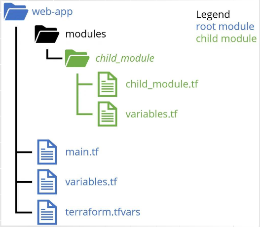

# notes

## podstawy

za chmurę płacimy wg. faktycznego zużycia usług

chmura obliczeniowa dostarcza usługi informatyczne (serwery, przechowywanie danych, bazy danych, usługi sieciowe, oprogramowanie, analizy i inteligencję) przez chmurę (internet)

nie trzeba mieć własnych serwerów

SKALOWALNA

chmura publiczna - są własnością i są zarządzane przez firmy co chętnie udzielają dostęp za kasę np. AWS

chmura prywatna - on-premise, całkowicie wewnętrzna

chmura hybrydowa - połączenie obu np. skorzystanie z publicznej gdy jest większe zapotrzebowanie, nowa funkcja, backupy  
a wrażliwe dane lokalnie z powodu np. RODO (dane muszą być w konkretnym kraju, ale dostęp do nich może być z publicznej chmury)

## EC2

umożliwia wypożyczenie komputerów wirtualnych do uruchomienia własnych aplikacji

skalowalne itd

łatwe zamykanie otwieranie instancji

mozna kontrolować geografię

płatność na bieżąco

czyli serwer w chmurze AWS

## S3 (Simple Amazon Storage Service)

pamięć masowa za pośrednictwem interfejsu usługi sieciowej

obiekt do 5 TB

każdy obiekt jest w bucket

REST i SOAP (simple object access protocal - koperta xml - deprecated)

domyślnie HTTP

obiekty to dane (zdjęcia, dokument, film...), klucze, metadane, tagi

obiekty zawierają metadane (content type, content lenght, last modified, etag)

aby zmienić obiekt, trzeba w całości go wrzucić od nowa

uważać na billing nieautoryzowanych użytkowników - już zmienili! czyli są error codes free of charge

dodać losowy przyrostek do nazw zasobników

żądając z S3 jasno określ region AWS

## VPS vs Cloud

VPS to wydzielona część jednego, fizycznego serwera

ograniczona skalowalność, przewidywalna płatność, proste zarządzanie, ograniczona, zawodna

Cloud skalowalny, niezawodny, tysiące serwerów, pay as you go, złożone zarządzanie

EC2 (Elastic Compute Cloud) to technicznie też chmurowy VPS "na sterydach"

AWS oferuje Lightsail - typowy VPS

## Docker

aplikacje w kontenerze docker będą działać tak samo wszędzie

kontenery uruchamiają się szybko co ułatwia skalowanie

izolacja w kontenerze

dzięki współdzieleniu jądra systemu operacyjnego lepsze wykorzystanie zasobów kompa w przeciwieństwie do VM

### kontener

kontener to proces uruchomiony w izolowanym środowisku na maszynie gospodarza

Server | Host OS | Docker Engine | Bins/Libs | App

linuks jest mądry no i tutaj każdy kontener ma własny system plików, sieci, użytkowników itd. (Namespaces)

cgroups - limitowanie zasobów ram cpu

kontenery są tępe, gdyby nie WSL, to by nie było linuksowych kontenerów na windowsie

jest wykonalną instancją obrazu:
    - obraz to szablon (kod, biblioteki, zależności, pliki konfiguracyjne - zmienne środowiskowe, polecenia domyślne)
    - kontener - uruchomiona instancja obrazu

Dockerfile -> Docker Image -> Docker Container

### VM

Server | Host OS | Hypervisor | Guest OS | Bins/Libs | App

izolacja, przydzielone zasoby, łatwa przenośność, nadmiarowość i odporność na awarie

większe zużycie zasobów niż kontener i dłuższy czas uruchamiania

### Dockerfile

FROM - określenie obrazu bazowego

RUN - wywołane podczas docker build

CMD - wywołane podczas docker run (zostanie zignorowane, jeśli użytkownik poda inne pisząc docker run (np. docker run my-img **ls -l**))

EXPOSE - informuje, że kontener nasłuchuje na tych portach

ENV - zmienne środowiskowe

COPY/ADD - kopiowanie plików do obrazu

WORKDIR - ustawia katalog roboczy dla RUN, CMD, ENTRYPOINT, COPY, ADD

```dockerfile
FROM node:alpine

RUN npm install

CMD ["npm", "start"]
```

### orkiestracja

monitoring stanu kontenerów i aplikacji, zbieranie i analiza logów, są kluczowe dla utrzymania wydajności, dostępności i bezpieczeństwa

integracja z narzędziami do tego

sieciowanie - izolacja sieci, balansowanie obciążenia, odkrywanie usług i komunikacja między kontenerami - kluczowe dla skutecznej komunikacji wewnątrz złożonych apek mikrousługowych

### cykl życia

|             |
V             V
Created -> Running <-> Paused
|             A
|             |
V             V
Deleted <- Stopped

docker build PATH | URL

docker create --name container-name my-img (create)

docker start container-name (start)

docker run my-img (create + start)

docker pause container-name

docker unpause container-name

docker stop container-name (bezpieczne zakończenie wszystkiego)

docker rm container-name (--volumes usuwa także woluminy zewnętrzne)

docker kill container-name

### Wolumeny (Volumes)

Służą do trwałego przechowywania danych, które muszą przetrwać restart lub usunięcie kontenera.
Dane są zarządzane przez Dockera i przechowywane w specjalnym miejscu na hoście.
Jeden wolumen może być podłączony do wielu kontenerów jednocześnie (do odczytu i zapisu).
Komendy: docker volume create, ls, inspect, rm.
Użycie: docker run -v nazwa_wolumenu:/sciezka/w/kontenerze moj_obraz.

### DockerHub

Oficjalne, chmurowe repozytorium obrazów Dockera (taki GitHub dla obrazów).
Przechowuje obrazy publiczne (dostępne dla wszystkich) i prywatne.
Zawiera obrazy oficjalne (zweryfikowane, bezpieczne) oraz od społeczności.
Umożliwia automatyczne budowanie obrazów po zmianach w kodzie na GitHub/Bitbucket.
Obsługuje wersjonowanie obrazów za pomocą tagów (np. node:18-alpine).

### Docker Compose

Narzędzie do zarządzania aplikacjami składającymi się z wielu kontenerów (np. apka + baza danych + cache).
Całą konfigurację (usługi, sieci, wolumeny) definiuje się w jednym pliku docker-compose.yml.
Upraszcza uruchamianie całego środowiska jedną komendą (docker-compose up).
Automatycznie tworzy wspólną sieć dla wszystkich kontenerów, aby mogły się ze sobą komunikować po nazwach usług.

### Optymalizacja obrazów Docker

Cel: mniejszy rozmiar obrazu, większe bezpieczeństwo i szybsze budowanie.
Techniki:
Używaj małych obrazów bazowych, np. alpine.
Łącz komendy RUN w jedną warstwę za pomocą &&, aby zmniejszyć liczbę warstw.
Usuwaj zbędne pliki (np. cache menedżera pakietów) w tej samej komendzie RUN, w której coś instalujesz.
Używaj pliku .dockerignore, aby nie kopiować do obrazu niepotrzebnych plików (np. node_modules, .git).
Korzystaj z budowania wieloetapowego (multi-stage builds) – najlepsza praktyka do oddzielenia środowiska budowania od produkcyjnego. W obrazie końcowym zostaje tylko gotowa aplikacja, bez narzędzi deweloperskich.

### Bezpieczeństwo kontenerów (podstawy)

NIGDY nie umieszczaj haseł, kluczy API i innych danych poufnych bezpośrednio w Dockerfile.
Do przekazywania takich danych używaj zmiennych środowiskowych.
docker run -e "HASLO_DO_BAZY=super_tajne_123" moj_obraz
(W bardziej zaawansowanych scenariuszach używa się Docker Secrets, HashiCorp Vault lub systemów zarządzania sekretami w chmurze).

## VPC (Virtual Private Cloud)

AWS tworzy nam własną wirtualną sieć, oddzieloną od innych klientów, konfigurowalną

## podsieci

dzielą VPC na mniejsze izolowane fragmenty, co zwiększa bezpieczeństwo - zapobiega nieautoryzowanemu dostępowi

logiczny podział zasobów na np. warstwę aplikacji i warstwę bazy danych

monitorowanie i zarządzanie podsieciami jest bardziej przejrzyste

optymalizacja wydajności - segmentacja sieci pozwala na optymalizację ruchu sieciowego i zasobów

segregacja ruchu sieciowego - pomaga kontrolować przepływ danych i zarządzanie dostępem

mozna mieć publiczną podsieć co serwuje html itd. i prywatną podsieć z backendem, która komunikuje się tylko z tamtą publiczną podsiecią

lepsza kontrola nad ruchem sieciowym - możliwość tworzenia dedykowanych tras routingu dla różnych podsieci pozwala na lepszą kontrolę i optymalizację ruchu sieciowego

zgodność z politykami bezpieczeństwa (dzięki, izolacja i kontrola dostępu)

monitorowanie pozwala na lepszy audyt i zgodność z wymogami bezpieczeństwa

przykłady:

- front i load balancery na publicznej, backend i baza na prywatnej
- dev/test - serwery do testowania publiczne bo wymagają dostępu z zewnątrz, prywatne - zasoby deweloperskie i testowe?
- hybrydowe środowisko chmurowe - publiczna bramka VPN do połączeń z lokalnymi centrami danych, prywatne zasoby produkcyjne i dane

jak ma 10.0.0.0/16 -> 10.0.x.x

IGW - internet gateway - braka łącząca sieć VPC z publicznym internetem (obie strony)

sieć publiczna ma po prostu trasy do IGW

## tablice tras

na podstawie kolumny destination i route kierują pakiety odpowiednią ścieżką w zależności od docelowego adresu IP

każdy VPC ma domyślnie automatyczną tablicę tras

każda podsieć musi mieć tablicę tras

do prywatnej sieci po prostu nie ma tras z publicznej

przykłady (0.0.0.0/0 to internet):

### IGW

route tables mogą kierować ruch do internetu i z powrotem

np. Destination  |  Target
    10.0.0.0/16     local
    0.0.0.0/0       igw-xxxxx
local - reguła domyślna. jeśli maszyny wewnątrz vpc chcą ze sobą rozmawiać, ruch pozostaje w sieci lokalnej
igw-xxxx - wszystko inne (ruch do internetu) idzie przez IGW

IGW zapewnia dostęp do internetu dla instancji EC2 i innych usług AWS w publicznych podsieciach

IGW zapewnia automatyczną skalowalność aby obsłużyć zmienny ruch

IGW - wysoka dostępność dzięki redundancji (bo ten numerek nie oznacza jednej małej rzeczy - to w pełni zarządzana przez AWS usługa)

jest to jakaś flota routerów? przełączników? ruch dynamicznie rozkładany między nie

infrastruktura, na której działa IGW, jest rozproszona po wielu AZ w danym regionie AWS (AZ - strefa dostępności - fizyczne centrum danych)

### NAT Gateway

bezpieczny, jednokierunkowy dostęp do internetu, np. pobranie aktualizacji (wiadomości z zewnątrz są przesyłane na "recepcję", która odrzuci przesyłki o które nikt nie prosił)

taki NAT musi być w sieci publicznej skoro potrzebuje dostęp do neta
generalnie podmienia adresy wysyłkowicza na własny
np. Destination  |  Target
    0.0.0.0/0       nat-xxxx
NAT Gateway jest zarządzaną usługą AWS, co oznacza, że AWS zajmuje się skalowaniem, zarządzaniem i utrzymaniem - nie trzeba jej konfigurować
NAT Gateway jest automatycznie skalowana i reduntantna w obrębie strefy dostępności (Availability Zone), co zmniejsza szansę awarii i niedostępności

### VPN Gateway i Direct Connect

- VPN - zaszyfrowany, dostęp do internetu, prędkość pewnie wolniejsza
- Direct Connect - prywatna dedykowana autostrada między prywatnymi podsieciami - dedykowane połączenie między lokalnym centrum danych a AWS - bardziej przewidywalne i niezawodne niż tradycyjne
    np.     Destination     |   Target
            192.168.0.0/16      vgw-xxxx
    vgw - virtual private gateway
    np. serwer aplikacji w AWS 10.0.1.50 chce połączyć się z naszym prywatnym serwerem 192.168.10.20
    no to będzie przesłany VGW - direct connect lub vpn

Direct Connect:

stabilne, szybkie, przewidywalna wydajność, izolowane od internetu, bezpieczny przesył danych z dodatkowymi mechanizmami szyfrowania

niższe koszty zwłaszcza przy dużej ilości danych

egress - dane wychodzące z zasobów AWS do świata zewnętrzengo

mniejsze opłacy za egress w porównaniu z publicznym internetem

możliwość dostosowania przepustowości do nawet 10 Gbps

łatwa integracja z VPC, S3, EC2 itd.

Pełna kontrola nad połączeniem: Umożliwia zarządzanie ruchem i konfiguracją sieci zgodnie z wymaganiami biznesowymi.

Wysoka dostępność: Możliwość konfiguracji redundantnych połączeń dla zapewnienia wysokiej dostępności i niezawodności.

### VPC peering

jakby dwie sieci VPC były jedną

prywatny most między dwoma VPC (nikt z zewnątrz nie ma dostępu)

druga strona musi zaakceptować takie połączenie

kontrolowany, bezpieczny dostęp np. danych z jednej firmy do innej

połączenie środowiska testowego i produkcyjnego w celu uproszczenia zarządzania i monitorowania

uproszczenie - połączenie różnych VPC dla łatwego dostępu do bazy danych czy plików

unikanie publicznego internetu - zmniejsza opóźnienia i zagrożenia

prywatność danych

umożliwa synchronizację baz danych w różnych regionach AWS

globalna dostępność aplikacji

globalne gromadzenie logów

prywatność danych - dane pozostają w prywatnej sieci szkieletowej AWS

np. w VPC A     Destination     |   Target
                172.31.0.0/16       pcx-1234
    w VPC B     Destination     |   Target
                10.0.0.0/16         pcx-1234

## security groups - SG

security groups to wirtualne firewalle, które regulują jaki ruch jest dozwolony do i z instancji EC2 i innych zasobów w ramach VPC

działają na poziomie instancji

reguły obejmują specyfikację protokołu (TCP/UDP/ICMP), portów oraz źródłowych adresów IP lub zakresów CIDR

CIDR to adres IP i maska podsieci np. 19.168.1.0/24 -> stałe jest 24 bity (24 / 8 = 3 sekcje) 192.168.1, zmienne xxx - 192.168.1.xxx

domyślnie jest chyba reguła pozwalająca na cały ruch wychodzący

jedna instancja może mieć wiele SG i każda SG może być przypisana do wielu instancji  
można zmienić SG to się wszędzie zaktualizuje

stanowa - czyli zapamiętane jak wszedł to może wyjść

tylko reguły allow

### dlaczego?

stanowcze zapory sieciowe - jak ruch dozwolony w jednym kierunku, to odpowiadajacy w drugim też (jak ktoś wejdzie do klubu może też wyjść)

pomagają w izolacji i ochronie VPC - szczegółowa kontrola dla każdej instancji lub grupy instancji  
czyli np. web tier - SG pozwala na ruch z LB    |   app tier - SG pozwala tylko na ruch z SG web tier   |   database tier - SG tylko z SG App tier  
ktoś włamie się na serwer webowy i tylko na tyle

## network ACLs (Access Control Lists)

SG działa na poziomie instancji, a ACL na poziomie podsieci (ruch sieciowy do i z podsieci)

działa naraz z SG

inbound i outbound rules

allow i deny rules

stateless - dla każdego ruchu reguła analizowana niezależnie czyli dla pakietu wychodzącego i wchodzącego osobne reguły są wymagane

od numeru najniższej do najwyższej, pierwsza reguła jest stosowana

domyślnie ACL pozwala na cały ruch outbound i inbound

każda reguła: allow/block na podstawie protokołu, portu i adresu IP

przykłady:

- pozwalać na HTTP/HTTPS (porty 80/443) i blokować inne niepotrzebne
- prywatne subnety - blokować ruch zewnętrzny pozwalając na ograniczą zaufane źródła

zgodność i bezpieczeństwo - dostosowane do regulacji branżowych np. PCI-DSS

segmentacja sieci - poprawiają bezpieczeństwo

szybkie blokowanie niechcianego/złośliwego ruchu

## IaC (Infrastucture as Code)

czyli pliki konfiguracyjne specyfikujące infrastukturę

za każdym razem efekt jest ten sam

w jednym miejscu zbiór wszystkich zmian i specyfikacji

kontrola wersji

### CloudFormation

tylko AWS (YAML lub JSON)

oferuje rollback

łatwe wdrażanie infrastruktury w kilku regionach i kontach

### Terraform

hcl (Hashicorp Configuarion Language) lub JSON - nie tylko do AWS

deklaratywny

git - wersjonowanie, code review, ci/cd

1. terraform init - pobiera wtyczki potrzebne do komunikacji z API chmury do .terrafom
2. terraform plan - tworzy plan, jakie faktycznie zmiany powinny być wprowadzone
3. terraform apply - wprowadza zmiany w życie

#### stan

plik .json co przechowuje aktualny stan konfiguracji infrastruktury i rzeczywistego mapowania zasobów Terraform do zasobów AWS

dzięki temu terraform wie, co musi tylko zmienić

jak terraform coś stworzy, to potem odpytuje AWS o np. IP i wtedy wszystko wie

stan jest przechowywany zdalnie, ale nie na GitHub! tylko na np. AWS S3 State Bucket z blokowaniem przez DynamoDB Lock Table

wyświetla outputs po zastosowaniu zmian co mogą inne moduły wykorzystać

domyślnie lokalnie przechowywany

przechowuje identyfikatory, atrybuty i zależności

nie modyfikować ręcznie, przeglądać, backupować, wersjonować

jest to kluczowe!!

#### terraform plan

analizuje różnice między plikiem stanu a stanem opisanym w plikach konfiguracyjnych

ustanawia co ma być utworzone, zmodyfikowane, usunięte

jest wyświetlany w konsoli dla pewnosci użytkownika

może być zatwierdzony przez innych członków lub ci/cd

może być użyty jako dokumentacja zmian

#### terraform apply [ lastest-plan ]

wykonuje plan (pyta o potwierdzenie chyba, że -auto-approve)

aktualizuje .tfstate

apply też niby generuje plan i go wykonuje - więc można pominąć terraform plan

#### terraform destroy [ -target=aws_instance.my_instance ]

niszczy istniejące zasoby opisane w plikach konfig

pyta o potwierdzeniu

aktualizuje stan

#### main.tf

nazwa plików .tf w sumie nie ma żadnego znaczenia

```tf
provider "aws" {
    region = "eu-central-1"
}

# aws_instance to resource type - inne to aws_s3_bucket
resource "aws_instance" "my_web_server" {
    ami = "ami-ny12u4h71284"
    instance_type = "t2.micro"

    tags = {
        Name = "HelloWorldServer"
    }
}
```

provider - określa dostawcę usług
można tu wsadzić region, profile, access keys jeśli nie używa się IAM albo AWS CLI, version
można mieć wielu dostawców?
aby skorzystać z dostawcy trzeba terraform init

resource to jednostka infrastruktury - maszyna wirtualna, grupa zabezpieczeń, baza danych

ami (Amazon Machine Image) - template dla instancji EC2 (z SO, architekturą, oprogramowanie serwerowe, konfiguracją startową, optymalizacją przez chmurę)  
**ami ma różne ID w różnych regionach**  
można też dać most_recent = true

```tf
provider "aws" {
  region = "eu-central-1"
}

# To jest "data source" - specjalny blok, który nie tworzy zasobów,
# ale pobiera informacje o już istniejących.
data "aws_ami" "latest_amazon_linux" {
  most_recent = true
  owners      = ["amazon"] // Szukamy oficjalnych obrazów od Amazona

  filter {
    name   = "name"
    values = ["amzn2-ami-hvm-*-x86_64-gp2"] // Wzorzec nazwy dla Amazon Linux 2
  }

  filter {
    name   = "virtualization-type"
    values = ["hvm"]
  }
}

# Teraz w definicji instancji odwołujemy się do wyniku wyszukiwania.
resource "aws_instance" "web_server" {
  # Terraform pobierze ID z bloku "data"
  ami           = data.aws_ami.latest_amazon_linux.id
  instance_type = "t2.micro"

  tags = {
    Name = "WebServer-from-latest-AMI"
  }
}

# Możemy nawet wyświetlić, jakie ID zostało znalezione
output "found_ami_id" {
  value = data.aws_ami.latest_amazon_linux.id
}
```

#### moduły

to folder z własnymi plikami konfiguracyjnymi

odpowiedzialny za jedną logiczną część infrastruktury

wersjonowanie

kluczowe element w budowaniu skalowalnych i łatwych do zarządzania konfiguracji



#### variables

```tf
variable "instance_type" {
    description = "Typ instancji EC2"
    type        = string
    default     = "t2.micro"
    validation {
        condition = length(var.instance_type) > 0
        error_message = "Fuck you"
    }
}
```

zmienne są używane w wielu miejscach

typy: string, number, bool, list, map, object

description, validation i default są opcjonalne

wartość jest przypisana w linii poleceń lub w plikach konfiguracyjnych lub w .tfvars lub w zmiennych środowiskowych

terraform plan i terraform apply zastępuje wystąpienia var.x rzeczywistą wartością

##### walidacje

min, max, konkretne wartości, wyrażenia regularne, długość łańcucha, weryfikacja czy list map ma elementy i jakie

funkcje length, regex, contains, &&, ||, !

dokumentować wymagania! definiować je z innymi członkami

##### locals

dostępne tylko w ramach pliku konfiguracyjnego czy modułu

```tf
locals {
    common_tags = {
        Owner = "devops team"
        Message = "AWS!"
    }
}
```

są niemodyfikowalne

brak wartości domyślnych i walidacji

użycie: local.nazwa

#### output

```tf
output "instance_id" {
    value = aws_instance.example.id
    description = "The ID"
    sensitive = false
}
```

przydają się, gdy chcemy przekazać jakieś info innej części konfiguracji AWS lub użytkownikowi

np. IP, ID zasobów itd.

szczególnie przydatne w modułach

uważać żeby nie logować itd. wrażliwych outputów - sensitive

#### załadowanie modułu

```tf
modeule "my_vpc" {
    source = "terraform-aws-modules/vpc/aws"
    # or local: "./modules/my_vpc_server"
    version = "1.0.0"

    name = "my_vpc"
    cidr = "10.0.0.0/16"

    # reszta zmiennych...

    tags = {
        Terraform = "true"
        Environment = "dev"
    }
}
```

## XaaS (anything as a service)

DaaS, IaaS -> PaaS -> SaaS (piramidka)

### IaaS

świadczenie maszyn wirtualnych i serwerów do hostowania IT rzeczy

np. Amazon EC2

### PaaS (Platform aaS)

AWS Elastic Beanstalk generalnie poziom abstrakcji wyżej nad EC2 - zajmuje się tworzeniem instancji EC2 itd.
szybkie hostowanie
opcjonalna baza danych, ELB, auto-scaling group, security group
czyli łączy x services AWS

### SaaS

udostępniasz aplikację na internecie, żeby zarobć na niej

## region

obszar geograficzny, w którym przechowywane są dane
podczas przeglądania zasobów ma się dostęp tylko do tych w regionie

np. us-east

## strefa dostępności (Availability Zone)

fizyczne centrum/centra danych z wieloma serwerami

1 region - n AZ

AZ w regionie są izolowane, ale połączone szybkimi łączami

np. us-east-1a

## serwery brzegowe (Edge Locations)

możliwie najniższe opóźnienie - bezpośrednio w mieście itd.

tylko część usług z tego korzysta - CloudFront, Route 53, Web Application Firewall, AWS Shield

## amazon S3 glacier

archiwizacja danych - tanie składowanie, szybkie przeszukiwanie

jedna z 3 klas pamięci:  

### S3 Glacier Instant Retrieval

milisekundy na odpowiedź

### S3 Glacier Flexible Retrieval

pobranie w parę minut lub zbiorcze w parę godzin

bezpłatne pobieranie dużej ilości danych

### S3 Glacier Deep Archive

najtańsze, odpowiedź w ciągu 12 godzin

## EBS (Amazon Elastic Block Store)

dyski twarde dla EC2 - dane dla określonych instancji

może być podłączony do wielu EC2 tylko w trybie multi-attach - inaczej tylko do jednej instancji na raz

mają się utrzymać niezależnie od czasu życia instancji

szybki dostęp i długoterminowa trwałość

## Amazon RDS (Relation Database Service)

ułatwia konfigurowanie, obsługę i skalowanie baz danych w chmurze

kompatybilność z MySQL, PostgreSQL, MariaDB, SQL Server itd.

## Amazon DynamoDB

nierelacyjne

klucz-wartość

ciągłe kopie zapasowe, redundancje, buforowanie, import i eksport danych

## Amazon Redshift

ogromna ilość danych do celów analizy biznesowej

SQL, hurtownie danych, jeziora danych, operacyjne bazy danych

## DB vs RDS

RDS zapewnia łatwą konfigurację i zarządzanie, skalowalność (w pionie - mocniejsza instancja, w poziomie - repliki do odczytu), automatyczne kopie zapasowe, wysoka dostępność, bezpieczeństwo, droższe

DB trzeba samemu zkonfigurować, zaprojektować rozwiązania wysokiej dostępności, mechanizmy kopii zapasowej, skalowanie, pełna kontrola nad bezpieczeństwem, niby tańsze ale drodzy inżynierzy co tym zarządzają

## AWS Identity and Access Management - IAM

identities - who requests (user, group, role, credentials)

permission - what is requested by the identity (policies, statements)

kluczowy element zabezpieczeń! kto w jaki sposób może korzystać z zasobów AWS, a także jakie operacje są dozwwolone

MFA

może użyć Active Directory (usługa Microsoft do zarządzania użytkownikami, hasłmi, grupami, dostępem do plików, drukarek itd.)

AWS IAM Identity Center może użyć AD, obejmuje SSO

## użytkownik

podmiot tworzony w AWS reprezentujący osobę lub aplikację

składa się z nazwy i poświadczeń

jeden użytkownik = jedno konto AWS

możliwość indywidualnego przypisywania uprawnieź użytkownikom

## rola

zestaw uprawnień co może jednostka robić w AWS

użytkownik IAM może przyjąć rolę, co zwiększa jego uprawnienia tymczasowo

## grupa

zbiór uprawnień dla użytkowników

## polityka uprawnień (policy)

po skojarzeniu z zasobem definiuje jego uprawnienia?

## konto root

na początku mamy dostęp do użytkownika z dostępem do wszystkiego (Stop using root acount -> use an admin account instead)

## przekazywanie danych

### HTTP Polling

co 5 sekund wysłanie zapytania do serwera - czy masz coś nowego?

### Long Polling

serwer odpowie dopiero, jak coś będzie nowego

### Server=Sent Events (SSE)

jednokierunkowe wysyłanie eventów do klienta (push) po nawiązaniu początkowego połączenia

klient otwiera połączenie, a serwer utrzymuje i wysyła wiadomości

powiadomienia, aktualizacje itd.

### WebSockets

dwukierunkowe, stałe połączenie klient-serwer

obie stroiny mogą inicjować wysyłanie wiadomości

czaty, gry online, edytory kolaboracyjne

### problem zamknietej karty

wtedy trzeba ręcznie dla SSE zamknąć połączenie aby nie marnować zasobów

prościej z AWS Simple Notification Service (SNS)

publish/subscribe

serwer wysyła wiadomość do tematu (topic), a następnie SNS rozsyła wiadomość do subskrybentów

subskrybentami mogą być AWS SQS (Queue kolejka wiadomości - nieograniczona liczba wiadomości, trwałość (różne lokalizacje przechowywania), przechwytywanie wiadomości nieprzetwarzalncyh), AWS Lambda, HTTP/S, E-mail, SMS

## microservices

systemy komunikują się ze sobą przez lekkie protokoły (REST, gRPC - Proto, Broker np. RabbitMQ)

## serverless

brak zarządzania serwerami, czyli dostawca AWS jest udpowiedzialny za udostępnianie, skalowanie i utrzymanie infrastruktury

## AWS Lambda

FaaS (i SaaS i PaaS i SaaS)

uruchamia kod (funkcję) w odpowiedzi na trigger (zapytanie http, dodanie pliku do S3, wiadomość w kolejce SQS lub SNS, zmiana w bazie danych DynamoDB)

płaci się tylko za czas wywoływania kodu i liczbę wywołań

FaaS skaluje się najprościej jak się da

PaaS wymaga pewnych przemyśleń co do skalowania

PaaS - apka działa cały czas, skaluje się całą aplikacje, konfiguracja serwera, środowiska, płaci się za włączony serwer nawet jak jest bezczynny, raczej droższy, chyba, że ruch jest ciągły

cold start - od długiego czasu nie była uruchamiana (lub pierwszy raz)
kod musi być pobrany, mikro kontener odpalony, inicjalizacja interpretera
problematyczne dla synchronicznego kodu
czas odpowiedzi z 50ms do sekund
mozna ustawić Provisioned Concurrency - licznę ciepłych instancji
lambda snapstart - dla Javy zapisuje RAM kontenera w pamięci co przyspiesza wszystko
języki interpretowane szybciej się uruchomią

## load balancer

### elastic load balancer

rozdziela ruch na wiele instancji

### alb - application load balancer

warstwa 7. czyli indywidualne żądanie HTTP/S

kieruje ruch do celów w VPC na podstawie treści żądania

np. /main i /blog mogą być przekierowanie gdzie indziej

aws (in)cognito? identyfikacja? obsługuje wiele domen?

### nlb - network load balancer

on jest do jak najniższego opóźnienia przy maksymalnej wydajności, działa w warstwie 4. na poziomie połączenia TCP/UDP/TLS

zoptymalizowany pod kątem nagłych i niestabilnych wzorców ruchu

### clb - classic load balancer

classic load balancer - stara rzecz, application load balancer bez path based routingu?

nie może serwować wielu domen w przeciwieństwie do kolegów

działa na poziomie warstwy 4 i 7 naraz

łączy alb i nlb

## AWS Fargate

Serverless dla kontenerów - mega proste

task definition - specyfikacja konteneru (obraz, konfiguracja, zasoby)

task - instacja kontenera

networking - działa w wirtualnej sieci VPC

każdy task ma własny interfejs sieciowy

## cloud trail

po prostu monitoruje każdą akcję na koncie AWS

audyty ryzyka, zarządzanie, zgonodść, audyty operacyjne

cloud trail - warto zasetupować na początku dla historii zmian (tuszowanie też utrudnia)

cloud trail - monitor ludzi (ich akcji)

## cloudwatch

monitorowanie zasobów AWS i aplikacji na AWS

cloudwatch - monitor usług

zaawansowane statystyki, metryki, własne metryki

akcje alarmowe aby np. uruchomić instancję, zamknać, wysłać wiadomość na SNS

## AWS Config

audyt i ocena konfiguracji zasobów

reguła żeby nie otweirać portu 22

## AWS Cognito

zarządzanie tożsamościami i dostępem użytkowników (np. web aplikacji)

bezpieczne logowanie, rejestracja, zarządzanie tożsamością

dodanie własnej walidacji i logiki

zewnętrzni dostawcy tożsamości Google, FB itd

obsługuje też login i hasło

wspiera MFA

bogaty zestaw SDK i API

automatyczne szyfrowanie danych przechowywanych i transmitowanych przy HTTPS

mozna użyć własnych kluczy szyfrujących

integruje się z Cloud Trail by wiedzieć kto się kiedy logował

proste, łatwe, skalowalne, bezpieczne, zgodne z standardami

zaawansowane profile użytkownika

niezwykle istotny serwis, chociaż trudno nam się z tym zapoznać

łatwo skalowalny (skoro płacimy AWS to zawsze będzie dobrze działać)

pozwala nam:

1. zrobić cały proces autentykacji bez większych nakładów deweloperski
2. odpowiednia zgodność ze standardami bezpieczeństwa

user pools - uwierzytelnianie użytkowników

identity pool - dostęp do zasobów użytkownikom (większa skala integracji z dostawcami tożsamości?)

można użyć oczywiście user i identity pools naraz

trend teraz jest taki - dużo stron logowanie tylko za pomocą zewnętrznych providerów nie login i hasło (rynek chiński inaczej)

dzięki identity i user użytkownik szybko ma dostęp do apki -> nie będzie się nudzić szukając maila aktywacyjnego w spamie

### User pools - autentykacja

własne katalogi użytkowników

rejestracja, logowanie itd.

generalnie uwierzytelnianie użytkowników

dodatkowa warstwa bezpieczeństwa np. SMS, wymagania siły haseł, automatyczne blokowanie po x nieudanych próbach

integracja z AWS Lambda

### Identity Pools - autoryzacja

dostęp do zasobów AWS na podstawie roli IAM

RBAC - Role Based Access Control - jakie akcje dla kogo

dynamiczne przypisywanie ról

idealne jak wymagany dostęp do zasobów AWS

uwierzytelnianie i autoryzacja IoT

## skalowalność

zdolność systemu do obsługi rosnącego obciążenia

### pionowa

mocniejszy serwer

single point of failure

prostsze

### pozioma

więcej serwerów

wymaga wsparcia działania wielu instancji naraz

## elastyczność

zdolność systemu do dodawania/usuwania zasobów w zależności od obciążenia

czyli skalowanie zasobów?

automatyczna zmiana liczby instancji EC2

skalowanie funkcji bezserwerowcyh

dostosowanie zasobów bazy danych

trudne: ciągłe monitorowanie, konfiguracja zasad, zwiekszenie kosztów przy złej konfiguracji

## bezstanowość

serwer nie przechowuje danych o użytkowniku między jego żądaniami

czyli każde niezalezne od innego

nie trzeba replikować stanu między instancjami, proste skalowanie poziome

jak: stan w bazie danych, stan po stronie klienta JWT (JSON Web Token), pamięć podręczna

## asynchroniczność

### Event Bridge

fajnie integruje się z różnymi usługami AWS

ma zestaw reguł, i event jest wysyłany w odpowiednią usługę

## dodatki z wykładu

### co warto od razu

uwierzytelnianie wieloetapowe

ustalenie odpowiedniego monitoringu dla konta - cloudtrail?

odpowiednia konfiguracja billingu

cloud trail - warto zasetupować na początku dla historii zmian

### sns

sns to taki broker

można z bridge do notyfikacji lub wiele innych

skalowalna i elastyczna

warto pamiętać jak działają topics

ogarnąć ile topiców trzeba dla jakiejś sytuacji typu czat grupowy?

### serverless

aws przykłady

podejście, w którym nie zarządzamy bezpośrednio infrastukturą i zasobami

coś tam o lambda (ograniczenia?)

wgrywamy kod i w przypadku lambdy płacimy tylko, jak kod jest uruchamiany

lambda - faas? coś tam, ze to funkcja?

różnica między lambdą co jest non stop używana a taką dawno nie używaną - lambda fajnie operuje na instancjach (pojawia się problem cold startu - lambda była zbyt długo nie odpalana, to trzeba załadować lambdę i wolne to)

### load balancer

rodzaje

nlb - network load balancer - on jest do jak najniższego opóźnienia przy maksymalnej wydajności, działa w warstwie 4.

alb - application load balancer - warstwa 7.? aws (in)cognito? identyfikacja? obsługuje wiele domen?

classic load balancer - stara rzecz, application load balancer bez path based routingu? obsługuje nagłówek warstwy 7.? łączy alb i nlb

dowiedzieć się więcej o warstwach!!

### cloud trail

cloud trail - warto zasetupować na początku dla historii zmian (tuszowanie też utrudnia)

### cloud watch

monitoruje i loguje usługi na AWS

wyświetla logi błędów, wyświetla zwykłe logi

alarmy -> może automatycznie wyłączyć lub uruchomić dodatkowe usługi

cloud watch pozwala nam na zrozumienie, co w naszej aplikacji dokładnie jak działa

poziom logowania zależy głównie od dewelopera aplikacji (zwłaszcza jak mikroserwisy i event driven, łatwiej dla monolita)

dla większych aplikacji jest konieczne

### aws config

mamy pewien zestaw reguł, konto AWS daje pewne uprawnienia i tyle - czasem można ich użyć w głupi sposób np. otworzyć port ssh 22 (pozwala to na sesje SSH na serwer)

(których portów lepiej nie otwierać AWS)

dzięki aws config można np. ustawić powiadomienie jak ktoś otworzy port 22

### cognito

niezwykle istotny serwis, chociaż trudno nam się z tym zapoznać?

pewnie nie będzie ale:

dostarcza możliwość zarządzania logowaniem, rejestracją użytkowników, uprawnieniom do zasobów

spełnia polityki bezpieczeństwa m.in. UE

wspiera zewnętrznych dostawców autoryzacji

dostarcza MFA (multi factor authentication)

łatwo skalowalny (skoro płacimy AWS to zawsze będzie dobrze działać)

dostarcza gotowe SDK API

pozwala nam:

1. zrobić cały proces autentykacji bez większych nakładów deweloperski
2. odpowiednia zgodność ze standardami bezpieczeństwa

user pools - uwierzytelnianie użytkowników

identity pool - dostęp do zasobów użytkownikom (większa skala integracji z dostawcami tożsamości?)

można użyć oczywiście user i identity pools naraz

trend teraz jest taki - dużo stron logowanie tylko za pomocą zewnętrznych providerów nie login i hasło (rynek chiński inaczej)

dzięki identity i user użytkownik szybko ma dostęp do apki -> nie będzie się nudzić szukając maila aktywacyjnego w spamie
